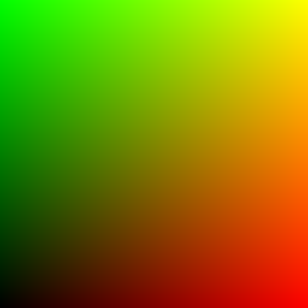

# WIP Rasterizer written in C

### used as an exercise for future development of a C++ game engine from scratch and a small step towards shader programming

Currently just a Bitmap encoder taking hegiht and width points, Feel free to submit a pr or point out issues: 

